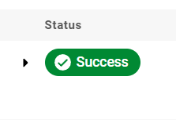

## Project Summary

This project goal is to operationalize this working, machine learning microservice using kubernetes, which is an open-source system for automating the management of containerized applications. Given a pre-trained, `sklearn` model that has been trained to predict housing prices in Boston according to several features, such as average rooms in a home and data about highway access, teacher-to-pupil ratios, and so on. You can read more about the data, which was initially taken from Kaggle, on [the data source site](https://www.kaggle.com/c/boston-housing). 
This project tests the ability to operationalize a Python flask app—in a provided file, `app.py`—that serves out predictions (inference) about housing prices through API calls. This project could be extended to any pre-trained machine learning model, such as those for image recognition and data labeling.


## Setup the Environment

* Create a virtualenv with Python 3.7 and activate it.

```bash
python3 -m pip install --user virtualenv
python3 -m venv ~/.devops
source .devops/bin/activate
```

* Run `make install` to install the necessary dependencies

* Running `app.py`

    1. Standalone:  `python app.py`
    2. Run in Docker:  `./run_docker.sh`
    3. Run in Kubernetes:  `./run_kubernetes.sh`

### Files

* `run_docker.sh` : Builds a docker image and runs the app
* `upload_docker.sh` : Deploys image to remote registry
* `run_kubernetes.sh` : Runs the app with kubernetes 
* `make_prediction.sh` : Test the app by making predictions 
* `Dockerfile` :  Used to build images automatically by DOcker
* `Makefile` :  Used to run app related script like install and lint
* `requirements.txt` :  Used to install dependencies for app
